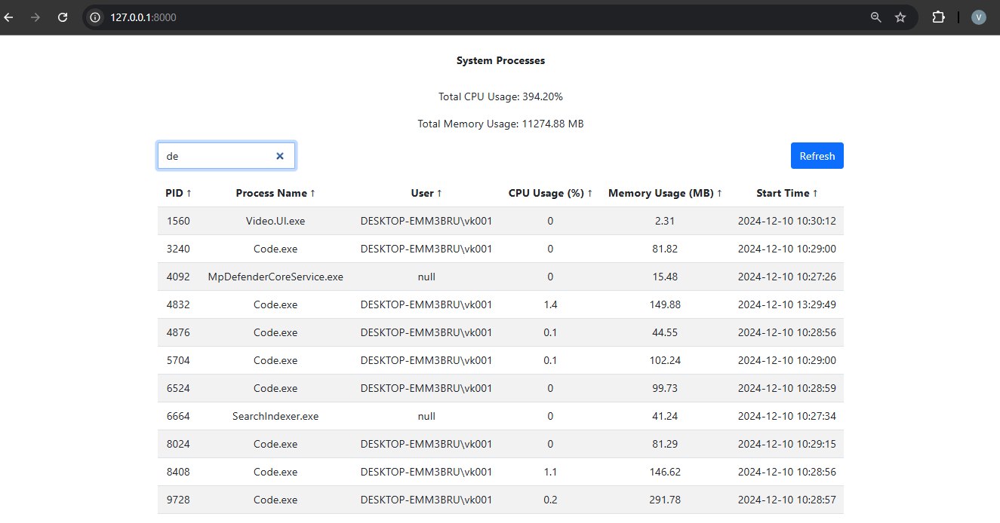
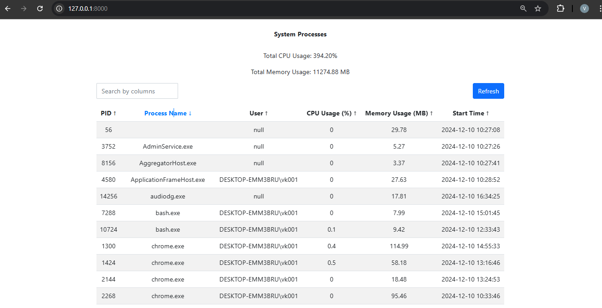
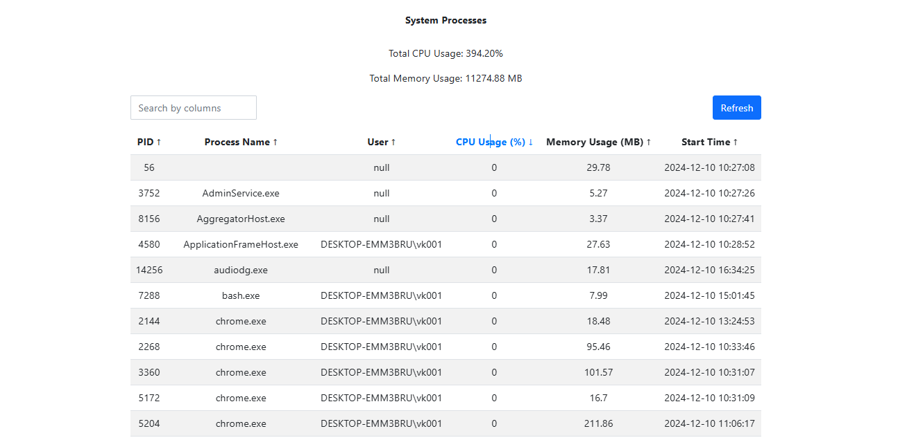
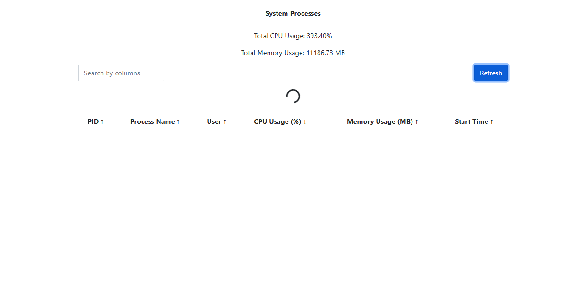

# SystemProcess

This project is a Django-based web application designed to monitor and display all running processes and programs on the host system. The application features a backend for retrieving process details and a user-friendly frontend for visualization. It is Dockerized for easy deployment and platform-independent

This application is structured using the Model-View-Template (MVT) architecture of Django, which divides the logic into three components:

- Model: Represents the data structure. I this project we don't have any thing to store in the database So I have not created a model for this project.

- View: Handles the business logic and user interaction.In this project, we have a get method that fetches all the running processes from the system. I have used the psutil library to gather system processes

- Template: Defines the user interface (UI) for displaying data.In this project, we have used simple HTML,CSS, JavaScript to form a table on UI and display all the processes in tabular form.

### Displays system processes with the following details
- Process ID (PID)
- Process Name
- User Running the Process
- CPU Usage (%)
- Memory Usage (MB)
- Start Time

### Features include
- Search/Filter: Find specific processes by process ID, Name,User, CPU Usage, Memory Usage,Start Time.

- Sort: User can sort process by process ID,Name, User,CPU Usage,Memory Usage,Start Time .As you can see in the below image we have sort by Name and CPU usage

- User can Click on refresh button to fetch new process from system.

## Setup and run the project without docker container
- `git clone https://github.com/vikeshdas/SystemProcess.git`

- `conda create -n env_name python=3.10`

- activate conda envirement

- got the directory of the project where requirement.txt file exist and run `pip install -r requirements.txt`

- run command python manage.py runserver

## Setup and run project in Docker container

- `git clone https://github.com/vikeshdas/SystemProcess.git`

- Open CMD and go to the directory of the project where Dockerfile exist.

- Create docker image from Dockerfile : Run command  `docker build -t web_image -f Dockerfile .`

- Run command `docker compose up web_service` to run project in container.
